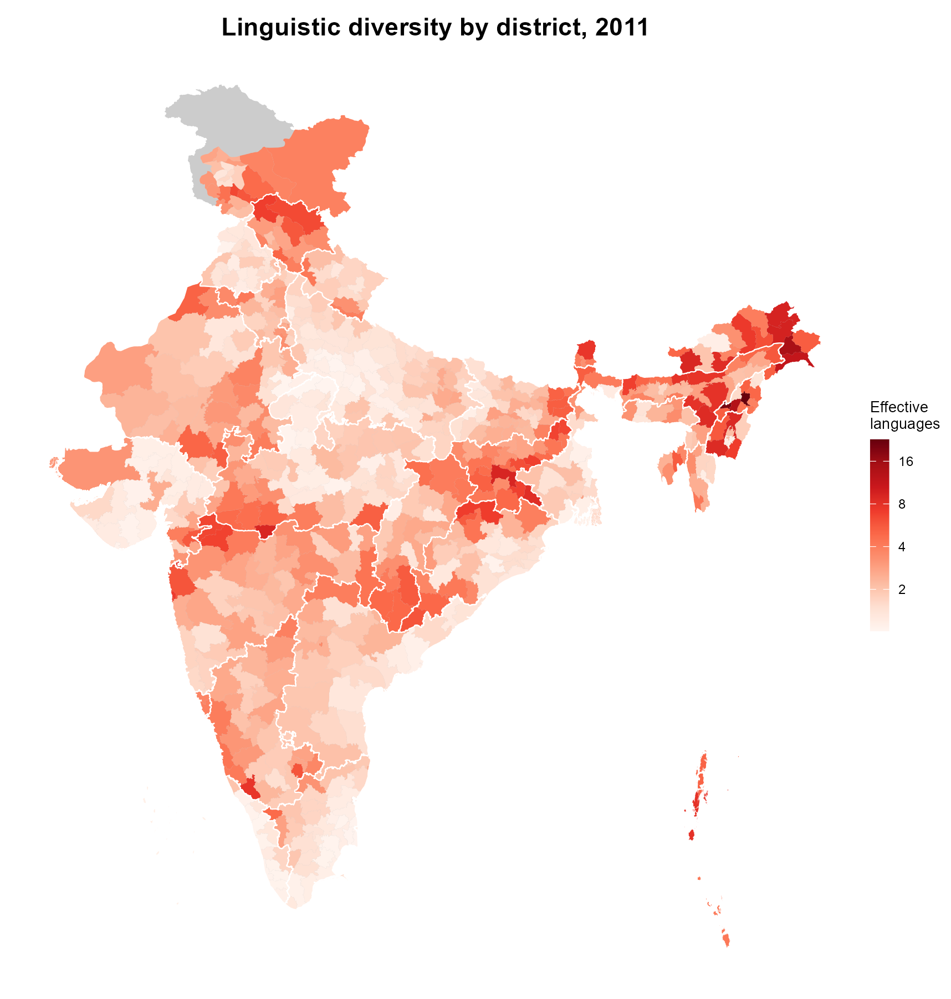
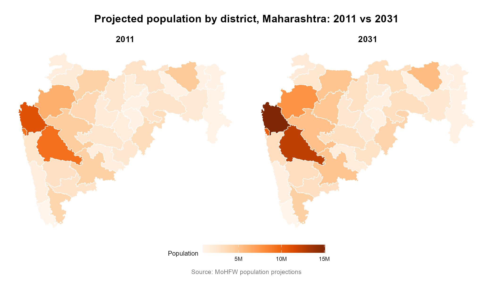

# censusindia

censusindia is an R package to query Census of India data, 1901 to 2011, at state,
district, and subdistrict level. It also provides MoHFW population projections through
2036. All data including population counts, primary census abstracts, mother tongue tables, and 
SC/ST tables can be 'attached' to district-boundary GeoJSONs for quick visualisation.

## Installation

```r
devtools::install_github("saketlab/censusindia")
```

## Quickstart

```r
library(censusindia)

get_census(2011, "state")
get_census(1971, "district", state = "Maharashtra")
get_census(1971, "district", state = "MH", geometry = TRUE)

list_census_variables()
search_census_variables("literacy")
list_census_geographies()

# MOHFW population projections (2011-2036)
get_population(2031, "state")
get_population(2031, "district")

# mother tongue speakers by district (2011)
census_languages() |> dplyr::filter(district_name == "Pune")
```

## Examples

Linguistic diversity by district:

```r
library(censusindia)
library(dplyr)

ling <- census_2011_linguistic_diversity |>
  rename(district = district_name) |>
  attach_geometry(2011, geography = "district")

plot_map(ling, "effective_languages",
  title = "Linguistic diversity by district, 2011",
  legend_title = "Effective\nlanguages",
  palette = "reds", show_state_boundaries = TRUE, trans = "log2"
)
```



Projected district-level population, Maharashtra 2011 vs 2031:

```r
mh_2011 <- get_population(2011, "district", state = "Maharashtra") |>
  attach_geometry(2011, geography = "district")
mh_2031 <- get_population(2031, "district", state = "Maharashtra") |>
  attach_geometry(2011, geography = "district")

compare_maps(
  list("2011" = mh_2011, "2031" = mh_2031),
  fill_var = "population",
  title = "Projected population by district, Maharashtra: 2011 vs 2031",
  palette = "oranges",
  base_layer = FALSE
)
```



Languages spoken in a district, ranked by speakers:

```r
library(dplyr)

census_languages() |>
  filter(district_name == "Pune") |>
  arrange(desc(total_speakers)) |>
  select(language_name, total_speakers)
```

## Vignettes

- [Getting started](https://censusindia.saketlab.org/articles/getting-started.html)
- [Primary Census Abstract, 2001 and 2011](https://censusindia.saketlab.org/articles/primary-census-abstract.html)
- [Population maps](https://censusindia.saketlab.org/articles/population-maps.html)
- [Population dynamics](https://censusindia.saketlab.org/articles/population-dynamics.html)
- [Population projections](https://censusindia.saketlab.org/articles/population-projections.html)
- [Sex ratio evolution](https://censusindia.saketlab.org/articles/sex-ratio.html)
- [SC/ST population distribution](https://censusindia.saketlab.org/articles/sc-st-population.html)
- [Social composition](https://censusindia.saketlab.org/articles/social-composition.html)
- [Linguistic diversity](https://censusindia.saketlab.org/articles/linguistic-diversity.html)
- [Tribal isolation and vulnerability](https://censusindia.saketlab.org/articles/tribal-isolation.html)
- [District population overview](https://censusindia.saketlab.org/articles/district-population.html)

